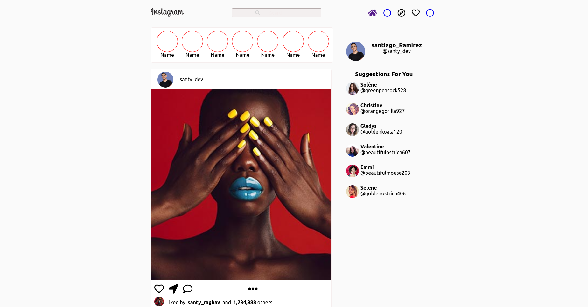

# instagram-clon

## Deploy

[deploy del proyecto](https://instagram-clon-bonpzn03d-santy-ramirez.vercel.app/)

----
## Para correr el proyecto en local Abrir una terminal y correr los siguientes comandos:

### Clonar con shh:
~~~
git clone git@github.com:santy-ramirez/instagram-clon.git

~~~

### Clonar con https:
~~~
git clone https://github.com/santy-ramirez/instagram-clon.git
~~~

### Ir al proyecto

~~~
cd instagram-clon
~~~
### Correr con el manejador de paquetes yarn, para instalar las dependencias

~~~
yarn 
~~~
### Correr el proyecto en local 
~~~
yarn dev
~~~

### abrir un navegador y visitar http://localhost:3000, deverias ver el proyecto 

---

## Para deployar el proyecto subir el proyecto a un repositorio en github con el mismo nombre que el proyecto y correr el siguiente comando:

~~~
shell deploy.sh
~~~
